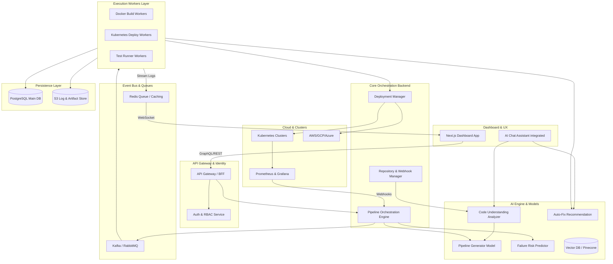

# Full System Architecture & Modular Breakdown

Oply requires a highly distributed, resilient, and event-driven architecture capable of orchestrating complex workloads and interacting dynamically with AI models.

## 1. System Architecture Diagram (Mermaid)

## 2. Modular Breakdown (Services and Responsibilities)

### 2.1. Gateway API Service (Node.js/NestJS)
- **Responsibility:** Act as the main entry point for the frontend, routing requests.
- **Functions:** Authentication, RBAC (Role-Based Access Control), rate limiting, GraphQL resolution.

### 2.2. Core Orchestrator Service (Go / NestJS)
- **Responsibility:** The centralized "brain" that tracks state transitions.
- **Functions:** Translates AI-generated workflows into actionable tasks, manages states (Pending, Running, Success, Failed). Integrates with Kafka.

### 2.3. AI Intelligence Service (Python / FastAPI)
- **Responsibility:** Hosts endpoints that interact with LLMs, orchestrates RAG (Retrieval-Augmented Generation).
- **Functions:** Handles prompt engineering for Pipeline Generation, Risk Prediction, Code Understanding, and the AI Assistant. Connects to Vector DB.

### 2.4. Worker Services (Go / Node.js)
- **Responsibility:** Heavy lifting and task execution.
- **Functions:** 
  - **Builder Worker:** Runs `docker build`, pushes to registries.
  - **Deploy Worker:** Applies YAML, Helm charts, triggers deployments.
  - **Log Aggregator Worker:** Collects running logs and pushes them into S3 and Redis streams for the frontend.

### 2.5. Telemetry & Observability Aggregator
- **Responsibility:** Ingests metric data from target environments.
- **Functions:** Parses Prometheus metrics, triggers Auto-rollback if error rates increase unexpectedly (connecting back to the Core Orchestrator).

## 3. Kubernetes Deployment Strategy

Oply's deployment architecture allows it to run inside the user's infrastructure natively. 

### Multi-Cloud & Cluster Integration
- **Agent-based Architecture:** Oply deploys a lightweight "Agent Pod" into the target user Kubernetes cluster.
- **Polling over Pushing:** To bypass restrictive firewalls, the Oply Agent securely polls the Oply Control Plane via HTTPS for pending deployment instructions, avoiding the need to expose user clusters to inbound traffic.
- **Deployment Lifecycle:**
  1. The API instructs a new deployment.
  2. The target Agent fetches the manifest.
  3. The Agent executes a Canary or Blue/Green deployment using Argo Rollouts or native K8s Deployment configurations.
  4. The Agent monitors health checks. If the readiness probes fail or error metrics spike, it automatically reverts the state and notifies the Core Engine for Failure Analysis.
