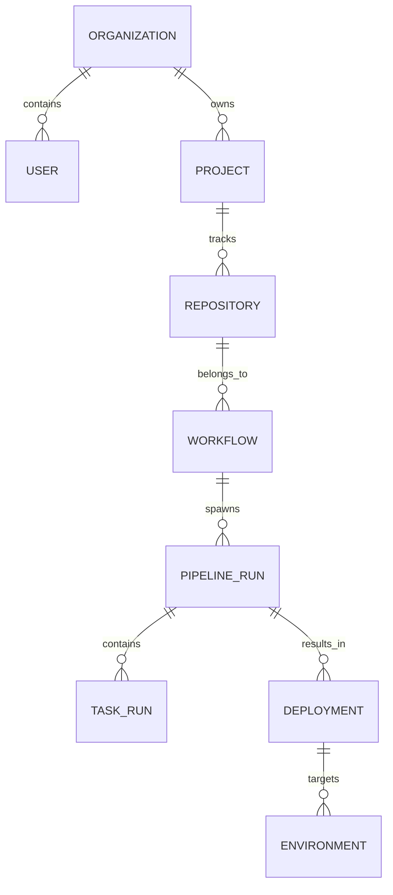

# Database Schema for Oply

The core relational data for Oply is managed using PostgreSQL. Redis is used heavily for transient data (logs, active queues).

## Schema Diagram Summary



## SQL Schema Definition (PostgreSQL / Prisma syntax)

```sql
-- Core Identity
CREATE TABLE "Organization" (
    "id" UUID PRIMARY KEY DEFAULT gen_random_uuid(),
    "name" VARCHAR(255) NOT NULL,
    "createdAt" TIMESTAMP NOT NULL DEFAULT NOW()
);

CREATE TABLE "User" (
    "id" UUID PRIMARY KEY DEFAULT gen_random_uuid(),
    "email" VARCHAR(255) UNIQUE NOT NULL,
    "role" VARCHAR(50) DEFAULT 'MEMBER', -- ADMIN, MEMBER, VIEWER
    "organizationId" UUID REFERENCES "Organization"("id")
);

-- Projects and Sources
CREATE TABLE "Project" (
    "id" UUID PRIMARY KEY DEFAULT gen_random_uuid(),
    "name" VARCHAR(255) NOT NULL,
    "organizationId" UUID REFERENCES "Organization"("id")
);

CREATE TABLE "Repository" (
    "id" UUID PRIMARY KEY DEFAULT gen_random_uuid(),
    "projectId" UUID REFERENCES "Project"("id"),
    "provider" VARCHAR(50), -- GITHUB, GITLAB, BITBUCKET
    "url" VARCHAR(255) NOT NULL,
    "branch" VARCHAR(255) DEFAULT 'main'
);

CREATE TABLE "Environment" (
    "id" UUID PRIMARY KEY DEFAULT gen_random_uuid(),
    "projectId" UUID REFERENCES "Project"("id"),
    "name" VARCHAR(50), -- DEV, STAGING, PRODUCTION
    "clusterConfig" JSONB -- Connection contexts / Agent IDs
);

-- Workflow Execution Engine
CREATE TABLE "Workflow" (
    "id" UUID PRIMARY KEY DEFAULT gen_random_uuid(),
    "repositoryId" UUID REFERENCES "Repository"("id"),
    "name" VARCHAR(255),
    "metadata" JSONB, -- AI-generated definition, triggers (push, schedule)
    "isActive" BOOLEAN DEFAULT true
);

CREATE TABLE "PipelineRun" (
    "id" UUID PRIMARY KEY DEFAULT gen_random_uuid(),
    "workflowId" UUID REFERENCES "Workflow"("id"),
    "commitHash" VARCHAR(255),
    "status" VARCHAR(50), -- QUEUED, RUNNING, SUCCESS, FAILED
    "startedAt" TIMESTAMP,
    "completedAt" TIMESTAMP,
    "aiAnalysis" JSONB -- For storing failure logic, auto-fix results
);

CREATE TABLE "TaskRun" (
    "id" UUID PRIMARY KEY DEFAULT gen_random_uuid(),
    "pipelineRunId" UUID REFERENCES "PipelineRun"("id"),
    "type" VARCHAR(50), -- BUILD, TEST, DEPLOY, NOTIFY
    "status" VARCHAR(50),
    "logsUrl" VARCHAR(500), -- Pointer to S3 log artifact
    "durationMs" INT
);

CREATE TABLE "Deployment" (
    "id" UUID PRIMARY KEY DEFAULT gen_random_uuid(),
    "pipelineRunId" UUID REFERENCES "PipelineRun"("id"),
    "environmentId" UUID REFERENCES "Environment"("id"),
    "version" VARCHAR(100),
    "status" VARCHAR(50), -- PROGRESSING, HEALTHY, ROLLED_BACK
    "aiRiskScore" INT -- 0 to 100 indicating chance of failure based on past data
);
```

### Purpose of Columns:
- **`metadata` inside Workflow:** Holds the AI-generated dynamic graph representation of the pipeline (not simple YAML, but parsed JSON that the engine understands).
- **`aiAnalysis` inside PipelineRun:** Caches exactly what the AI system concluded regarding any execution failures, preventing re-querying the LLM continuously for the same pipeline run.
- **`aiRiskScore` inside Deployment:** Calculated by the **Risk Prediction Model** prior to deploying, dictating if a manual approval gate is necessary.
